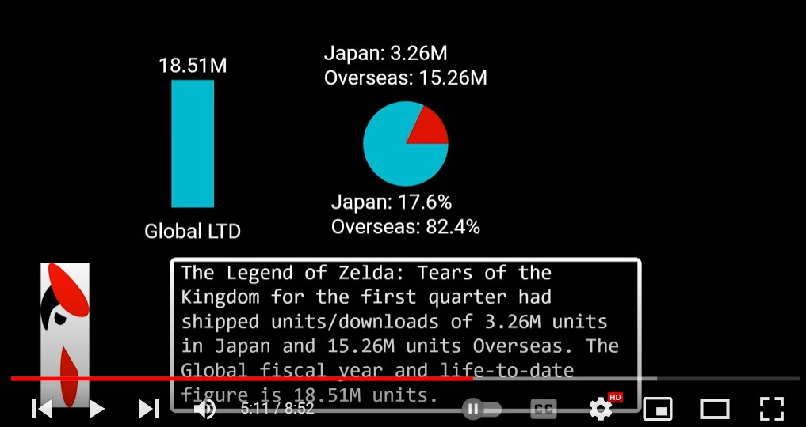

# Nintendo Earnings Canvas

## Description

A project using the data from my other repository: Nintendo Earnings Data and Other Video Game Companies. By using Motion Canvas I can visualize data with the Canvas API and output it into MP4 file format.

## Table of Contents

 - [Installation](#installation)
  - [Background History](#background-history)
  
  - [Deployed Application](#deployed-application)
  - [Tests](#tests)
  - [Questions](#questions)

## Installation

Node.js v16 or higher and then:
```
npm init @motion-canvas@latest
``` 
Which will install Motion Canvas with Vite and TypeScript. A CLI will appear giving you the options for your settings.

## Deployed Application

Link to one video from this project created using Motion Canvas:
[https://youtu.be/N5sT07oee_I](https://youtu.be/N5sT07oee_I)

Example Image:


## Tests

No tests written.

## Questions

  You can find my GitHub profile at: https://github.com/r134x7

  If you have any questions, you can contact me by email: r134x7@gmx.com